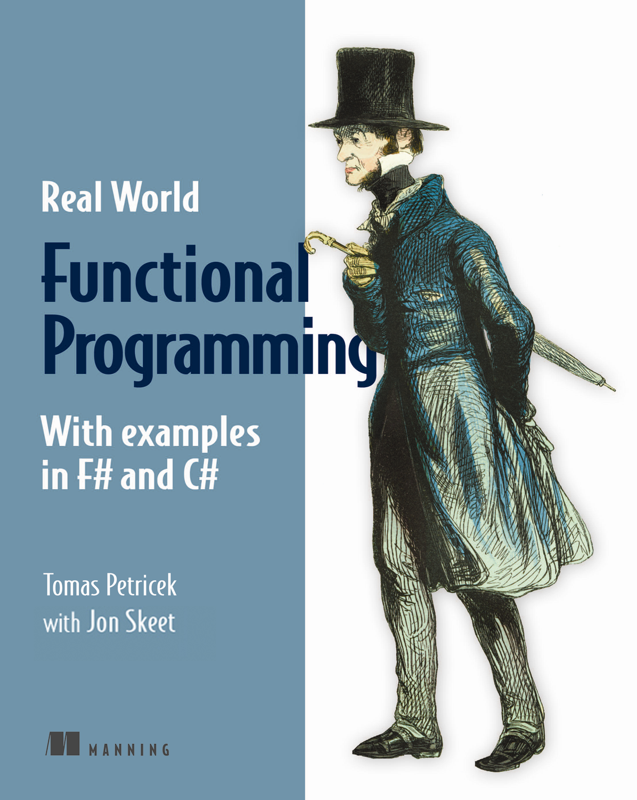
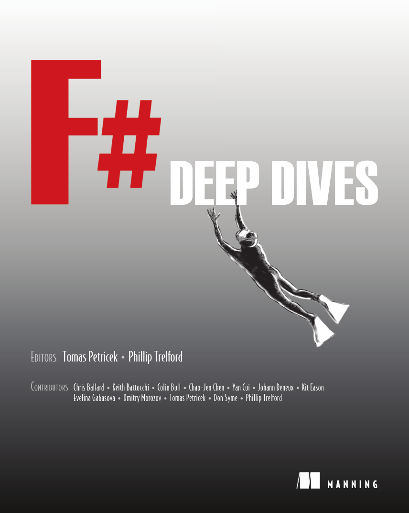
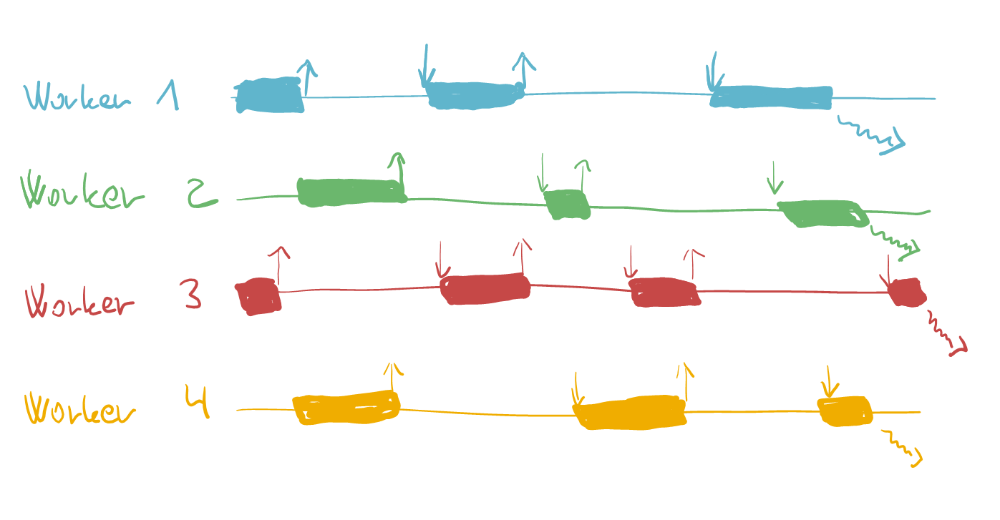
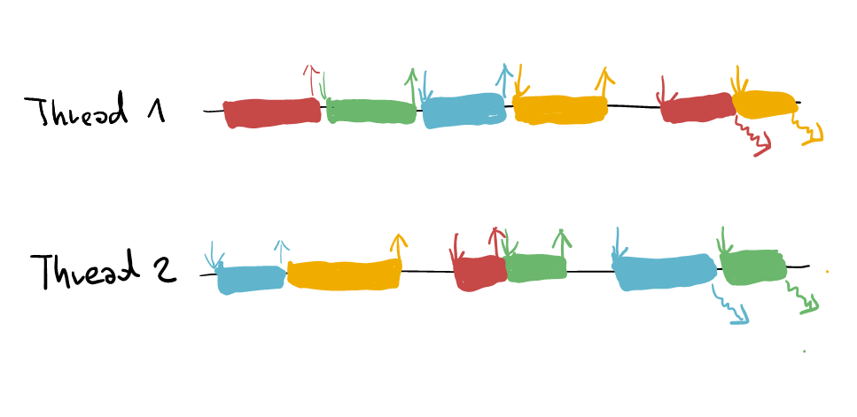

- title : Capturing domain logic in F#
- description : From types to domain specific languages
- author : Tomas Petricek
- theme : white
- transition : none

****************************************************************************************************

# Reactive and async abstractions

## How do they work and why F# shines

Tomas Petricek 
[www.fsharpworks.com](http://www.fsharpworks.com)

----------------------------------------------------------------------------------------------------

# Welcome to the workshop!

 

## Tomas Petricek

 - Write a popular F# book for C# devs
 - Contractor with F# team at MSR
 - Collaboration with BlueMountain Capital
 - First blogged about F# in 2006
 - Recently started at University of Kent

## About you

 - Where do you work? On what projects?
 - Are you using F#? Are you planning to?
 - What do you want to learn?

****************************************************************************************************
 
# INTRO
 
## Business perspective

----------------------------------------------------------------------------------------------------

# What the experience says?

## [fsharp.org/testimonials](http://fsharp.org/testimonials/)

We have (...) been able to use the support for [Asynchronous] workflows producing code that is 
_simple and clear and easy to understand_ but still runs in parallel when required.

The agent-based programming model offered by F#'s `MailboxProcessor` allows us to build 
_thread-safe components with high-concurrency requirements_ effortlessly

C# has gained support for (...) async/await, but these are _poor imitations of the 
original F# implementations_ and have flaws.

----------------------------------------------------------------------------------------------------

# F# from the business perspective

**Time-to-market**

 - Makes development faster by leading in the right direction

**Efficiency**

 - Performance profile of C# with easy to use async 

**Complexity**

 - Easily model different async and reactive abstractions

**Correctness**

 - Many C# async errors simply cannot happen with F#

----------------------------------------------------------------------------------------------------

# Expressing intent with F#
## Not a pattern, but a way of thinking

 - Code that helps _understand what it means_
 - Build _complex logic_ from _simple_ primitives
 - Compose _correct code_ from correct blocks
 - Using _types_ for enforcing correctness

----------------------------------------------------------------------------------------------------

# Expressing intent with F#
## Applies at multiple levels

 - Defining _data types_ in business domain
 - Choosing async or reactive _abstractions_
 - Processing data with _active patterns_
 - Composing _functions_ in functional style
 - Specifying machine learning _features_

****************************************************************************************************

# DOMAIN

## Type driven development

----------------------------------------------------------------------------------------------------

# Make invalid states unrepresentable

**First representation** of a contact:

    type Contact =
      { Name : string
        Email : EmailAddress option
        Phone : PhoneNumber option }

**Second representation** of a contact:

    type ContactInfo =
      | EmailOnly of EmailAddress
      | PhoneOnly of PhoneNumber
      | EmailAndPhone of EmailAddress * PhoneNumber
    type Contact =
      { Name : string; Contact : ContactInfo }

What is the differnece? Which `Contact` is the _correct type_?

----------------------------------------------------------------------------------------------------

# Composing functional types

## Compose domain using three building blocks

** <i class="fa fa-times-circle"></i> Product** using Tuples or Records

 - Combine values of different types in one value

** <i class="fa fa-plus-circle"></i> Choice** using Discriminated Unions

 - Choose one of several alternative values

** <i class="fa fa-chevron-circle-right"></i> Repetition** using Sequences and Lists

 - Zero or more values of the same type

----------------------------------------------------------------------------------------------------

# Composing functional types

## Functions to model more abstract domains

**Producer** and **consumer** return and take values

 - `unit -> 'T` and `'T -> unit`

**Subscription** takes a function and calls it later

 - `('T -> unit) -> unit`

----------------------------------------------------------------------------------------------------

# Make invalid states unrepresentable

**Asynchronous** programming

    type Async<'T> =
      abstract Start : ('T -> unit) -> unit

**Parallel** programming

    type Task<'T> = 
      abstract Value : option<'T>
      abstract OnCompleted : (unit -> unit) -> unit 
      
**Reactive** programming 

    type IObservable<'T> =
      abstract Subscribe : ('T -> unit) -> IDisposable

----------------------------------------------------------------------------------------------------

## If it is not easy, it is impossible!

(Or, at least, you should think very carefully about it...)

****************************************************************************************************

# WORKSHOP
## Reactive and asynchronous programming

----------------------------------------------------------------------------------------------------

# What does _asynchronous_ mean again?

----------------------------------------------------------------------------------------------------

# Synchronous execution

----------------------------------------------------------------------------------------------------

# Asynchronous execution

----------------------------------------------------------------------------------------------------

# Buzzword bingo

 - _Asynchronous_ computations
 - _Pull-based_ and _lazy_ streams
 - _Push-based_ streams
 - _Pull-based_ and _asynchronous_ streams

----------------------------------------------------------------------------------------------------

## Asyncs and tasks

---------------------------------------------------------------------------------------------------

# Asynchronous workflows

 - Computation, not a task
 - Calls continuation once

 
 
 
    type Async<'T> = 
      abstract Start : ('T -> unit) -> unit

---------------------------------------------------------------------------------------------------

# Task parallel library 

 - Running task, not a computation
 - Inherently mutable

 
 
 
    type Task<'T> = 
      abstract Value : option<'T> 
      abstract OnCompleted : (unit -> unit) -> unit

---------------------------------------------------------------------------------------------------

## Events and observables

---------------------------------------------------------------------------------------------------

# Observable

 - Calls continuation repeatedly
 - Returns function for cancelling subscription

 
 
 
    type IObservable<'T> = 
      abstract AddHandler : ('T -> unit) -> (unit -> unit)

 
---------------------------------------------------------------------------------------------------

# Async sequences

- Asynchronously ask for next value
- Pull-based, not push-based

 
 
 
    type AsyncSeq<'T> = Async<AsyncSeqRes<'T>>
    and AsyncSeqRes<'T> = 
      | Nil
      | Cons of 'T * AsyncSeq<'T>

****************************************************************************************************

# CLOSING

## Why F# shines

---------------------------------------------------------------------------------------------------

# Domain modelling for concurrency 
## If it is not easy, it is impossible!

_**Async**_ for asynchronous computations 
_Tasks_ do not compose well

_**Observables**_ for push-based streams 
or _Events_ if you want state sharing

_**Async sequences**_ for pull-based streams

---------------------------------------------------------------------------------------------------

# Revisiting the testimonial

C# has gained support for (...) async/await, but these are _poor imitations of the 
original F# implementations_ and have flaws.

---------------------------------------------------------------------------------------------------

<h2 class="fragment">F# async workflows compose well</h2>

    [lang=csharp]
    async Task WorkThenWait() {
      Thread.Sleep(1000);
      Console.WriteLine("work");
      await Task.Delay(1000);
    }

    void Demo() {
      var child = WorkThenWait();
      Console.WriteLine("started");
      child.Wait();
      Console.WriteLine("completed");
    }

---------------------------------------------------------------------------------------------------

<h2 class="fragment">F# warns you when you ignore result</h2>

    [lang=csharp]
    async void ThrowExceptionAsync() {
      throw new InvalidOperationException();
    }
    
    public void CallThrowExceptionAsync() {
      try {
        ThrowExceptionAsync();
      } catch (Exception) {
        Console.WriteLine("Failed");
      }
    }    
        

---------------------------------------------------------------------------------------------------

<h2 class="fragment">F# has cancellation support built-in</h2>

    [lang=csharp]
    async string DownloadPageAsync(string url, CancellationToken ct) {
      var request = HttpWebRequest.Create(url);
      ct.ThrowIfCancellationRequested();
      using (var response = await request.GetResponseAsync())
      using (var stream = response.GetResponseStream()) {
        ct.ThrowIfCancellationRequested();
        var buffer = new byte[4096];
        var temp = new MemoryStream();
        int count;
        do {
          ct.ThrowIfCancellationRequested();
          count = await stream.ReadAsync(buffer, 0, buffer.Length);
          await temp.WriteAsync(buffer, 0, count);
        } while (count > 0);
        temp.Seek(0, SeekOrigin.Begin);
        return new StreamReader(temp).ReadToEnd();
      }
    }
    
    
****************************************************************************************************

# CLOSING

## Learning more about F#

---------------------------------------------------------------------------------------------------

non-profit _books and tutorials_

_cross-platform_ **community** data science

## F# Software Foundation

commercial support **open-source** _contributions_

machine learning **[www.fsharp.org](http://www.fsharp.org)** web and cloud

consulting  _user groups_ research

----------------------------------------------------------------------------------------------------

# The F# Community

## Community chat and Q&A

 - **#fsharp** on Twitter  
   [twitter.com/hashtag/fsharp](https://twitter.com/hashtag/fsharp)
 - **FSSF** on Slack  
   [fsharp.slack.com](https://fsharp.slack.com)
 - **StackOverflow** F# tag  
   [stackoverflow.com/questions/tagged/f#](http://stackoverflow.com/questions/tagged/f%23)

----------------------------------------------------------------------------------------------------

# The F# Community

## Open source on GitHub

 - Microsoft **Visual F#** repo  
   [github.com/Microsoft/visualfsharp](http://github.com/Microsoft/visualfsharp)
 - **F# Compiler** and core libraries  
   [github.com/fsharp](http://github.com/fsharp/)
 - **F# Incubation** project space  
   [github.com/fsprojects](http://github.com/fsprojects/)
 - **FsLab** Organization repositor  
   [github.com/fslaborg](http://github.com/fslaborg/)
 - And numerous [private F# repositories](https://github.com/search?utf8=%E2%9C%93&q=f%23)

----------------------------------------------------------------------------------------------------

# Thanks for attending

## Stay in touch!

_<i class="fa fa-envelope"></i>_ [info@fsharpworks.com](mailto:info@fsharpworks.com)  
_<i class="fa fa-twitter"></i>_ [@fsharpworks](http://twitter.com/fsharpworks)

_<i class="fa fa-envelope"></i>_ [tomas@tomasp.net](mailto:tomas@tomasp.net)  
_<i class="fa fa-twitter"></i>_ [@tomaspetricek](http://twitter.com/tomaspetricek)

